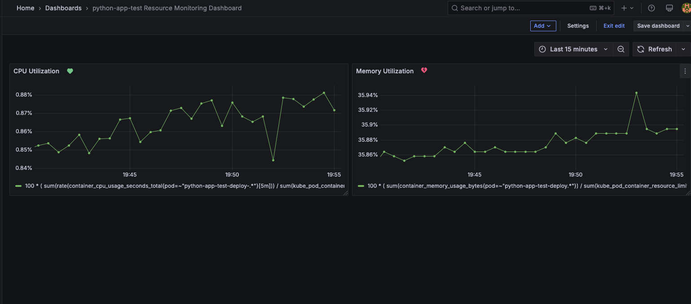
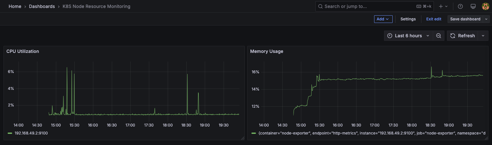
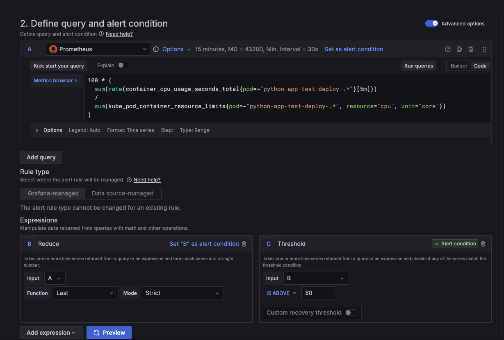
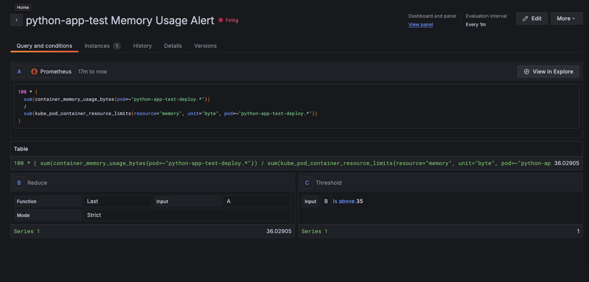
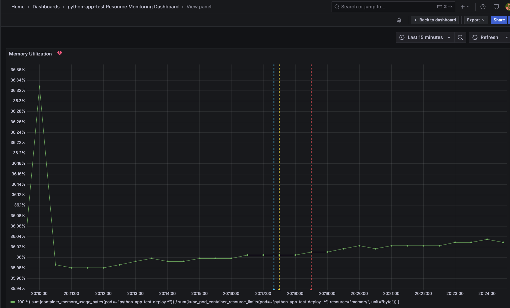
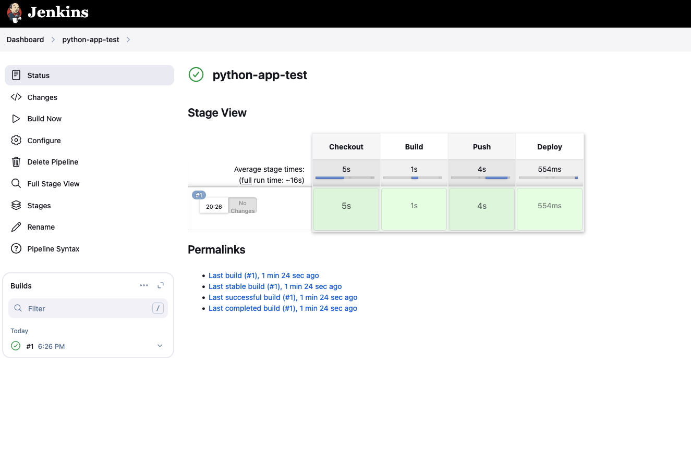

# Python k8s app with monitoring

A show case of a Python web application containerized and deployed to a Kubernetes cluster, with Jenkins as CI/CD. For telemetry collection used Promethous and Grafana for alerts and vizualization of collected metrics.

## Motivation and Challenges

It wasn’t necessary to use Kubernetes for such a small application, but I chose to include it in this showcase for demonstration purposes.
The most challenging part was setting up the Jenkins agent (working node) inside Kubernetes. There were a lot of back-and-forth errors that I had to troubleshoot before getting it to work.
Additionally, I spent roughly five hours setting up and collecting metrics with Grafana and Prometheus, as it was my first time working with this stack (I primarily used AWS CloudWatch before).

---

## Screenshots

Application Monitoring Dashboard:


Node Resource Monitoring Dashboard:


Application CPU Alert Settings:


Application Memory Utilization Alert (Firing):


Memory Utilization Panel (Firing):


Jenkins Job:


---

## Prerequisites

Required Instrumentation (must be installed on your machine):
- kubectl
- minikube
- helm

---

## Architecture

This show case is designed to be run on [Minikube](https://minikube.sigs.k8s.io/docs/). Configurations for running it in cloud-based environment might differ.

All services are deployed on a single node, Jenkins, Prometheus, and Grafana are running in a `devops-tools` namespace while application in `default`.

---

## How to Deploy

Clone this repository on machine with Minikube cluster up and running. Execute:

```sh
cd kubernetes && \
chmod +x deploy.sh && \
./deploy.sh
```

---

## How to Access

Run `minukebe ip` in your terminal to retrieve minikube exposed IP address.

Jenkins - `http://<minikube_ip>:32000/`
Web Application - `http://<minukube_ip>:32001/`
Prometheus - `http://<minikube_ip>:32002/`
Grafana - `http://<minikube_ip>:32003/`

---

## Docs

- [Jenkins](./jenkins/README.md).
- [Deployment Process](./kubernetes/README.md).
- [Grafana](./kubernetes/grafana/README.md).
- Python web application [OpenApi Spec](./openapi.yaml).
